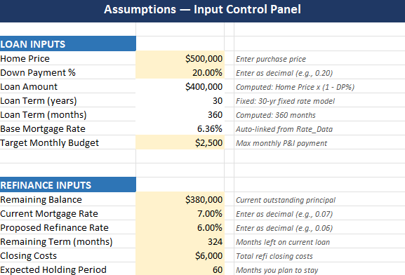
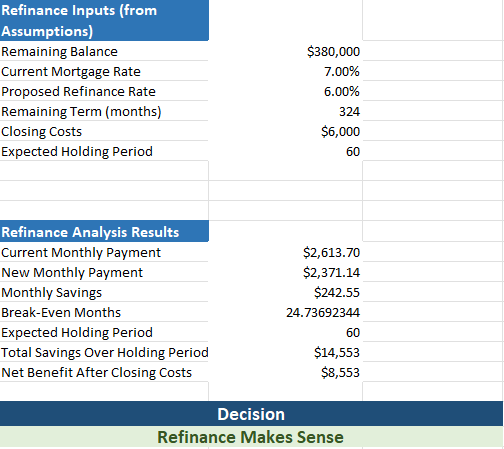

# QuantPath Mortgage Rate Intelligence Stack

**Phase 1 — Excel Financial Modeling & Dashboard** ✅ Complete  
**Phase 2 — R Time-Series Analysis Layer** 🔲 Planned  
**Phase 3 — SQL / Cloud Data Layer** 🔲 Planned  

---

## Project Overview

This repository contains a multi-phase financial analytics project built around the FRED/Freddie Mac 30-Year Fixed Mortgage Rate series (MORTGAGE30US). The project translates historical and current mortgage-rate data into practical household finance scenarios and decision-support outputs.

Phase 1 is a fully functional Excel workbook that answers five business questions about mortgage affordability, payment sensitivity, lifetime interest burden, and refinance decision-making. It is designed as a reusable decision-support template: the rate environment is sourced from real FRED data, while borrower and refinance assumptions are configurable inputs.

---

## Phase Status

| Phase | Description | Status | Tech |
|---|---|---|---|
| Phase 1 | Excel financial modeling & dashboard | ✅ Complete | Excel, FRED data |
| Phase 2 | R time-series analysis layer | 🔲 Planned | R, tidyverse, forecast |
| Phase 3 | SQL / cloud data layer | 🔲 Planned | SQL, AWS Athena, S3 |

---

## Business Questions Answered (Phase 1)

| # | Question | Answer Location |
|---|---|---|
| BQ1 | How have 30-year fixed mortgage rates changed historically, and where does the latest rate sit relative to the past? | Rate_Data sheet; Dashboard |
| BQ2 | How much does a mortgage rate increase or decrease change the monthly payment on a representative loan? | Rate_Shock_Model; Dashboard |
| BQ3 | How does the interest-rate environment affect total interest paid over the full life of the loan? | Rate_Shock_Model; Amortization_Schedule; Dashboard |
| BQ4 | Given a fixed monthly payment budget, how much loan principal is affordable at different mortgage rates? | Rate_Shock_Model; Dashboard |
| BQ5 | Under what conditions does refinancing become financially attractive, and how long does it take to break even? | Refinance_Analysis; Dashboard |

---

## Workbook Preview

Screenshots are stored in `screenshots/workbook/`.

| Worksheet | Preview |
|---|---|
| Project Map |  |
| Assumptions |  |
| Rate Shock Model |  |
| Refinance Analysis |  |
| Amortization QA |  |

---

## Repository Structure

```
quantpath-mortgage-rate-intelligence/
├── README.md                          # This file
├── CHANGELOG.md                       # Version history
├── .gitignore
│
├── data/
│   ├── raw/
│   │   └── MORTGAGE30US.csv           # FRED weekly 30-yr fixed rate data
│   └── README.md                      # Dataset provenance and column definitions
│
├── excel/
│   ├── Rate_Shock_Loan_Affordability_Refinance_Dashboard.xlsx
│   └── README.md                      # Workbook guide and usage instructions
│
├── screenshots/                       # Workbook worksheet screenshots
│   └── workbook/
│       ├── Amortization_QA.png
│       ├── Assumptions.png
│       ├── Project_Map.png
│       ├── Rate_Shock_Model.png
│       └── Refinance_Analysis.png
│
├── docs/
│   ├── phase1_workbook_brief.md       # Business questions, scope, formula families
│   ├── data_dictionary.md             # Column and named range definitions
│   ├── formula_reference.md           # Formula patterns and sign convention
│   └── roadmap.md                     # Phase 1–3 roadmap with honest status
│
├── specs/                             # Kiro spec-driven development artifacts
│   ├── requirements.md
│   ├── design.md
│   └── tasks.md
│
├── phase2_r/                          # R time-series analysis (planned)
│   └── README.md
│
└── phase3_sql/                        # SQL / cloud layer (planned)
    └── README.md
```

---

## Data Source

**Series**: MORTGAGE30US — 30-Year Fixed Rate Mortgage Average in the United States  
**Provider**: Federal Reserve Bank of St. Louis (FRED) / Freddie Mac Primary Mortgage Market Survey  
**Frequency**: Weekly (Thursday)  
**Coverage**: April 2, 1971 – May 14, 2026 (~2,877 observations)  
**Units**: Percent, not seasonally adjusted  
**URL**: https://fred.stlouisfed.org/series/MORTGAGE30US

---

## How to Use the Workbook

1. Open `excel/Rate_Shock_Loan_Affordability_Refinance_Dashboard.xlsx` in Microsoft Excel (desktop).
2. Navigate to the **Assumptions** sheet and adjust the yellow input cells to match your scenario:
   - Home price, down payment percentage, and target monthly budget
   - Refinance inputs: remaining balance, current rate, proposed rate, closing costs, holding period
3. All model sheets and the Dashboard recalculate automatically.
4. No macros or add-ins are required.

See [`excel/README.md`](excel/README.md) for a full sheet-by-sheet guide.

---

## Tech Stack

- **Microsoft Excel** — financial modeling, PMT/PV/CUMIPMT/PPMT formula families, named ranges, conditional formatting
- **FRED / Freddie Mac** — primary mortgage rate data source
- **Python / openpyxl** — workbook build automation (spec-driven development)
- **Kiro** — spec-driven development workflow (requirements → design → tasks)

---

## About This Project

This project is part of the QuantPath portfolio — a series of financial analytics projects connecting academic coursework, professional certificate learning, real-world datasets, and modern data tooling. Phase 1 connects to applied Excel-based analytics and financial modeling, while Phase 2 will extend the analysis into R-based time-series modeling as part of IBM’s Data Analytics with Excel and R Professional Certificate learning path and Applied Time Series Analysis coursework at North Carolina Central University.

**GitHub:** [ChieNwosu](https://github.com/ChieNwosu)
**LinkedIn:** [ChiemelaJosephNwosu](https://www.linkedin.com/in/chiemela-nwosu-23a791144) 
