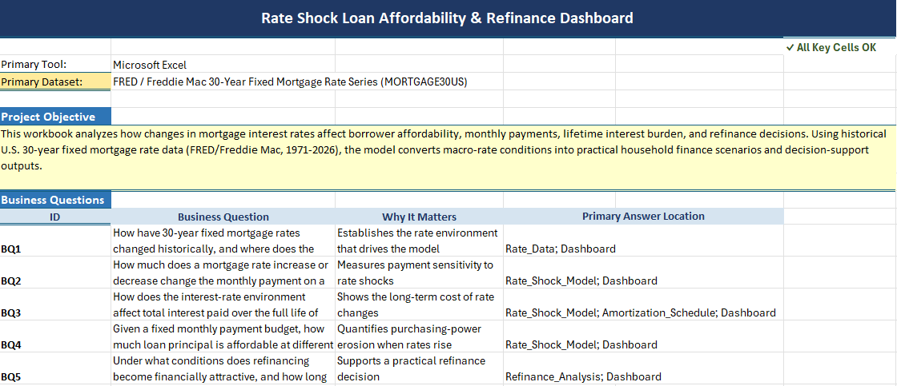
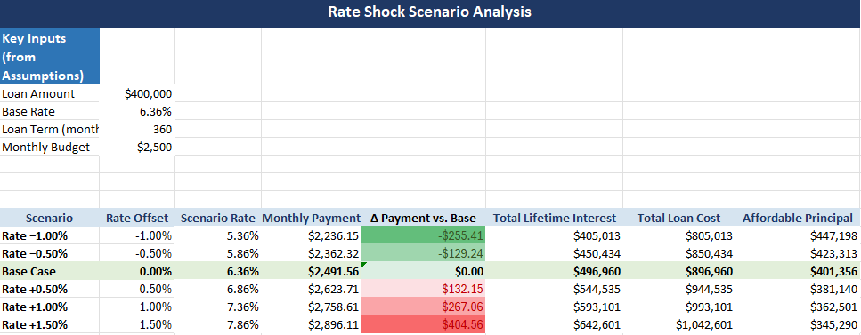
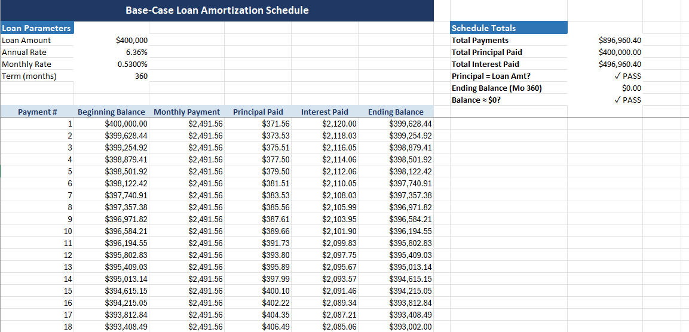

# QuantPath Mortgage Rate Intelligence Stack

**Phase 1 Deliverable:** Rate Shock Loan Affordability & Refinance Dashboard in Excel

---

## Overview

The **QuantPath Mortgage Rate Intelligence Stack** is a multi-phase financial analytics project that transforms mortgage rate data into actionable borrower insights. Phase 1 delivers a production-ready Excel workbook that models loan affordability, payment sensitivity, lifetime interest costs, amortization schedules, and refinance decision support.

This project demonstrates end-to-end financial modeling capabilities, from data ingestion to interactive dashboard design, with a roadmap extending into time-series forecasting (R), SQL-based data warehousing, and cloud-native analytics architecture.

---

## Business Problem

Mortgage rates directly impact:
- **Home affordability** — How much house can a borrower afford at current rates?
- **Payment sensitivity** — How do rate changes affect monthly payments?
- **Refinance timing** — When does refinancing make financial sense?
- **Lifetime interest costs** — What is the total cost of borrowing over the loan term?

Borrowers, lenders, and financial advisors need a decision-support tool that:
1. Translates rate data into affordability metrics
2. Models payment scenarios across rate environments
3. Evaluates refinance opportunities with break-even analysis
4. Provides transparent, auditable calculations

---

## Dataset

**Source:** [FRED Economic Data](https://fred.stlouisfed.org/) / Freddie Mac  
**Series:** 30-Year Fixed Rate Mortgage Average in the United States  
**Series ID:** `MORTGAGE30US`  
**Frequency:** Weekly  
**Coverage:** Historical mortgage rates from 1971 to present

The dataset provides the historical and current rate environment. Borrower-specific assumptions (loan amount, down payment, credit profile, refinance scenarios) are configurable model inputs.

---

## What the Workbook Does

The Excel workbook is a **reusable financial modeling template** that:

1. **Ingests mortgage rate data** from the FRED/Freddie Mac series
2. **Calculates affordability metrics** based on borrower income and debt constraints
3. **Models payment sensitivity** across rate scenarios (current, historical, stress-test)
4. **Generates full amortization schedules** with principal/interest breakdowns
5. **Evaluates refinance opportunities** with break-even analysis and decision flags
6. **Presents results in an interactive dashboard** with KPI cards and scenario comparisons

---

## Business Questions Answered

### 1. Affordability Analysis
- What is the maximum home price a borrower can afford at the current mortgage rate?
- How does affordability change across different rate environments?
- What monthly payment fits within the borrower's budget?

### 2. Payment Sensitivity
- How much does a 1% rate increase affect monthly payments?
- What is the payment difference between current rates and historical averages?
- How do rate shocks impact long-term affordability?

### 3. Refinance Decision Support
- Should the borrower refinance at current rates?
- What are the monthly savings from refinancing?
- What is the break-even period for refinance closing costs?
- How much lifetime interest can be saved?

### 4. Lifetime Interest Analysis
- What is the total interest paid over the loan term?
- How does the interest burden change with different rates or loan terms?
- What is the principal-to-interest ratio over time?

---

## Workbook Structure

The workbook is organized into **7 interconnected worksheets**:

| Worksheet | Purpose |
|-----------|---------|
| **Dashboard** | Executive summary with KPI cards and scenario comparisons |
| **Assumptions** | Centralized input hub for borrower profile and loan parameters |
| **Rate_Data** | FRED/Freddie Mac mortgage rate time series |
| **Rate_Shock_Model** | Payment calculations across current, historical, and stress-test rates |
| **Amortization_Schedule** | Full loan amortization with principal/interest breakdown |
| **Refinance_Analysis** | Refinance evaluation with break-even and savings analysis |
| **Project_Map** | Workbook health check and navigation guide |

---

## Key Excel Formulas Used

### Affordability Calculation
```excel
=PMT(rate/12, term*12, -loan_amount)
```
Calculates the monthly payment for a given rate, term, and loan amount.

### Maximum Affordable Home Price
```excel
=(max_monthly_payment / PMT(rate/12, term*12, -1)) * (1 - down_payment_pct)
```
Reverse-engineers the maximum home price from the target monthly payment.

### Amortization Schedule
```excel
Interest Payment: =IPMT(rate/12, period, term*12, -principal)
Principal Payment: =PPMT(rate/12, period, term*12, -principal)
Remaining Balance: =previous_balance - principal_payment
```

### Refinance Break-Even Period
```excel
=refinance_closing_costs / monthly_savings
```
Calculates how many months it takes for monthly savings to offset closing costs.

### Refinance Decision Logic
```excel
=IF(AND(monthly_savings > 0, breakeven_months < max_acceptable_breakeven), 
    "Refinance Makes Sense", 
    "Stay with Current Loan")
```

---

## How to Use the Workbook

### Step 1: Update Mortgage Rate Data
1. Download the latest `MORTGAGE30US` series from [FRED](https://fred.stlouisfed.org/series/MORTGAGE30US)
2. Paste the data into the `Rate_Data` worksheet
3. The workbook automatically pulls the most recent rate into the `Assumptions` sheet

### Step 2: Configure Borrower Assumptions
Navigate to the `Assumptions` worksheet and update:
- **Income & Debt:** Annual income, monthly debt obligations, target debt-to-income ratio
- **Loan Parameters:** Home price, down payment, loan term, credit score
- **Refinance Scenario:** Current loan balance, current rate, proposed rate, closing costs

### Step 3: Review the Dashboard
The `Dashboard` worksheet displays:
- **Affordability KPIs:** Maximum affordable home price, monthly payment, loan amount
- **Rate Shock Comparison:** Payment differences across rate scenarios
- **Refinance Decision:** Monthly savings, break-even period, recommendation

### Step 4: Drill into Details
- **Rate_Shock_Model:** Compare payments across current, historical, and stress-test rates
- **Amortization_Schedule:** View the full payment schedule with principal/interest breakdown
- **Refinance_Analysis:** Evaluate refinance scenarios with detailed savings calculations

---

## Workbook Screenshots

> **Note:** Copy the following files from your local Excel Projects folder into the `screenshots/` folder before publishing:
> - `Amortization QA.png`
> - `Assumptions.png`
> - `Project Map.png`
> - `Rate Shock Model.png`
> - `Refinance Analysis.png`

### Project Map


### Assumptions (Input Panel)


### Rate Shock Model


### Amortization Schedule QA


### Refinance Analysis


---

## Limitations

### Phase 1 Scope
- **Static rate data:** Requires manual updates from FRED (no live API integration)
- **Single-borrower model:** Does not support co-borrower scenarios or joint income
- **Fixed-rate loans only:** Does not model adjustable-rate mortgages (ARMs)
- **No tax/insurance:** Does not include property taxes, homeowners insurance, or PMI
- **No prepayment modeling:** Does not calculate the impact of extra principal payments

### Data Constraints
- **Weekly frequency:** Rate data is weekly; daily rate changes are not captured
- **National average:** Rates are U.S. national averages; regional variations are not modeled
- **Historical data only:** No forward-looking rate forecasts

---

## Phase 2 Roadmap: R-Based Time Series Analysis

Phase 2 will extend the Excel foundation with **R-based time-series forecasting** aligned with Applied Time Series Analysis coursework at NCCU.

### Planned Capabilities
- **ARIMA/SARIMA modeling** of mortgage rate trends
- **Forecast accuracy evaluation** (RMSE, MAE, MAPE)
- **Scenario generation** for stress-testing affordability models
- **Automated data pipeline** from FRED API to R to Excel

### Deliverables
- R scripts for data ingestion, modeling, and forecasting
- Forecast outputs exported to Excel for dashboard integration
- Technical documentation of model selection and validation

**Status:** Planned (not yet implemented)

---

## Future Extensions

### Phase 3: SQL Data Warehouse
- Centralized mortgage rate and borrower data storage
- Historical trend analysis and cohort segmentation
- Support for multi-borrower scenarios

### Phase 4: Cloud-Native Architecture
- **AWS-aligned design:** S3 for data storage, Lambda for ETL, RDS for structured data
- **Databricks integration:** Scalable time-series modeling and feature engineering
- **Tableau Public dashboards:** Interactive visualizations for public portfolio presentation

### Phase 5: Advanced Analytics
- Machine learning models for rate prediction
- Borrower risk scoring and credit profile optimization
- Refinance opportunity alerts based on rate thresholds

**Status:** All future phases are planned but not yet implemented.

---

## Technical Stack

### Phase 1 (Completed)
- **Excel:** Financial modeling, dashboard design, formula-based calculations
- **Data Source:** FRED/Freddie Mac `MORTGAGE30US` series
- **Version Control:** Git/GitHub

### Phase 2 (Planned)
- **R:** Time-series analysis, ARIMA/SARIMA modeling, forecasting
- **R Packages:** `forecast`, `tseries`, `quantmod`, `ggplot2`

### Phase 3+ (Planned)
- **SQL:** PostgreSQL or MySQL for data warehousing
- **Cloud:** AWS (S3, Lambda, RDS), Databricks
- **Visualization:** Tableau Public

---

## Repository Structure

```
quantpath-mortgage-rate-intelligence/
├── excel/                          # Phase 1 Excel workbook
│   └── Rate_Shock_Loan_Affordability_Refinance_Dashboard.xlsx
├── data/                           # Raw mortgage rate data
│   └── MORTGAGE30US.csv
├── screenshots/                    # Workbook screenshots for documentation
│   ├── dashboard.png
│   ├── rate_shock_model.png
│   ├── amortization_schedule.png
│   └── refinance_analysis.png
├── docs/                           # Technical documentation
│   ├── workbook_guide.md
│   ├── formula_reference.md
│   └── qa_validation.md
├── phase2_r/                       # Phase 2 R scripts (scaffold)
│   └── README.md
├── phase3_sql/                     # Phase 3 SQL scripts (scaffold)
│   └── README.md
├── specs/                          # Kiro spec files
│   └── polish-excel-workbook/
│       ├── requirements.md
│       ├── design.md
│       └── tasks.md
├── _config.yml                     # GitHub Pages configuration
├── index.md                        # GitHub Pages homepage
├── README.md                       # Repository README
├── CHANGELOG.md                    # Version history
└── .gitignore                      # Git ignore rules
```

---

## About the Author

**Chiemela Joseph Nwosu**  
Information Technology Student, Applied Data Analysis — North Carolina Central University (NCCU)

This project demonstrates:
- Financial modeling and dashboard design in Excel
- Data-driven decision support for mortgage affordability and refinancing
- Structured project planning with phased roadmap execution
- Portfolio-ready documentation and version control practices

**GitHub:** [ChieNwosu](https://github.com/ChieNwosu)  
**LinkedIn:** [Add your LinkedIn profile here]

---

## License

This project is licensed under the MIT License. See `LICENSE` for details.

---

## Acknowledgments

- **Data Source:** Federal Reserve Economic Data (FRED) / Freddie Mac
- **Coursework:** Applied Time Series Analysis, NCCU
- **Tools:** Microsoft Excel, R, Git/GitHub, Jekyll (GitHub Pages)

---

## Contact

For questions, feedback, or collaboration opportunities:
- **Email:** [JosephCNwosu@yahoo.com]
- **GitHub Issues:** [Open an issue](https://github.com/ChieNwosu/quantpath-mortgage-rate-intelligence/issues)

---

**Last Updated:** May 25, 2026
